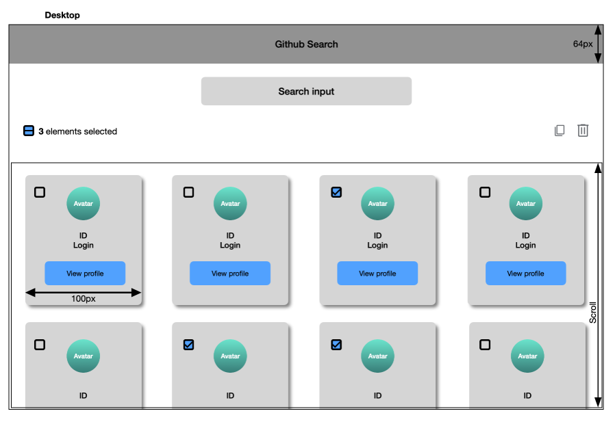

# Github User Search

Confirmed Frontend technical test for [fulll.fr](https://www.fulll.fr/) built with **React, TypeScript and Vite**.

The application allows users to search Github accounts in real-time using the Github API and manage the results through a simple selection system.

---

# Features

- Real-time search (no submit button required)
- Debounced API requests
- AbortController to cancel previous requests
- Responsive layout
- Edit mode
- Select individual users
- Select all users
- Duplicate selected users
- Delete selected users
- Loading state
- Empty state
- Error handling
- Unit tests and integration tests

---

# Tech Stack

- React
- TypeScript
- Vite
- Vitest
- React Testing Library

---

# API

Github REST API
GET https://api.github.com/search/users?q={USER}

---

# Edge Cases Handled

- No results found
- Github API rate limit
- User typing quickly (request cancellation with AbortController)

---

# Project Structure

```
src
├── components
│   ├── SearchInput
│   ├── Toolbar
│   ├── UserCard
│   ├── EmptyState
│   └── ShowData
│
├── hooks
│   └── useGithubUsers
│
├── services
│   └── githubApi
├── types
└── tests
```

# Run the Project

Install dependencies

```
npm install
```

Start development server

```
npm run dev
```

Run tests

```
npm run test
```

---

## Notes

This project was implemented following the constraints of the exercise:

- No external libraries were added except testing libraries.
- Modern frontend API requests were used (`fetch`, `AbortController`).
- The UI was implemented following the provided mock.

## Mockup

Below is the UI mockup provided for the exercise.



## AI Assistance

During this exercise, AI tools were used to speed up certain tasks and improve productivity.

Tools used:

- ChatGPT
- GitHub Copilot

Usage:

- Reviewing code structure
- Improving documentation (README)
- Helping write and adjust some unit tests
- Discussing best practices and edge cases
- Assisting with generating clear and professional commit messages

All implementation choices, architecture decisions, and final code were reviewed and fully understood before being committed.
